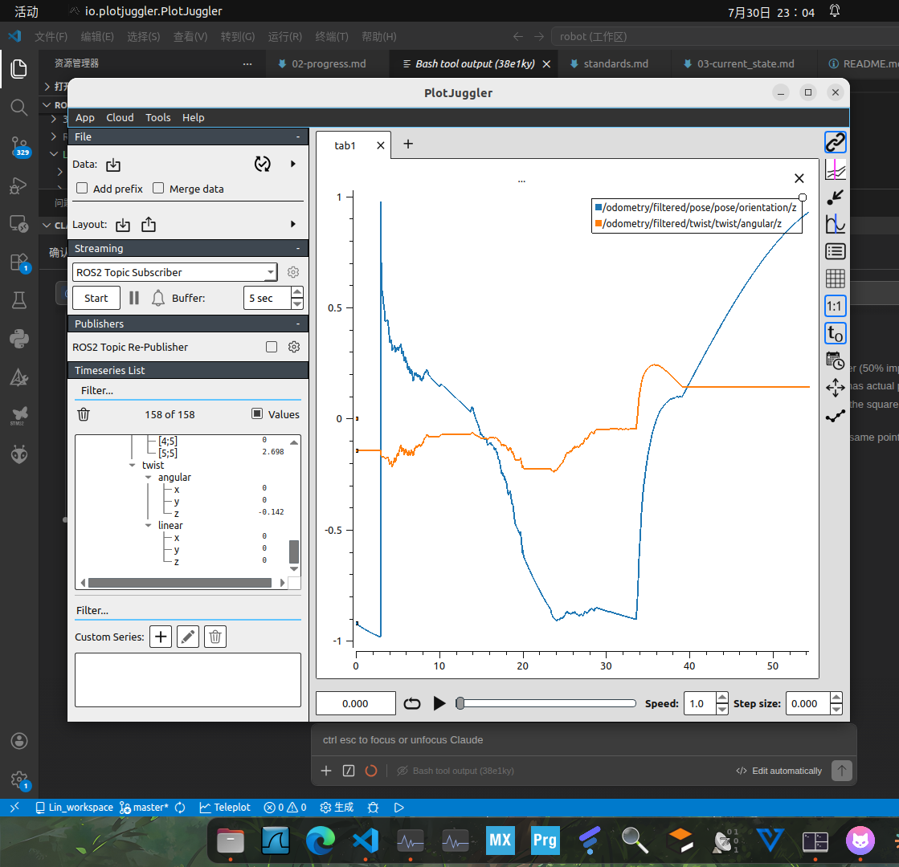

# 底盘彻查 + EKF 过程噪声 bug 排障（进行中存档）

> 日期: 2026-08-05
> 机器: N97（192.168.1.210）+ 开发 VM（192.168.1.204）
> 状态: ⏸ **进行中，用户临时离开**。代码修复已就位、EKF 已验证；底盘重启验证未做。
> 本文件为本地存档，**未提交 git**，回来确认后提交。

---

## 一、问题脉络（三条线汇合）

### 线 1：/odometry/filtered 与 KISS-ICP 位置差 5 米（闭环测试发现）

车开回原点后三家对照：

| 来源 | x/y | yaw | 判定 |
|:-----|:-----|:-----|:-----|
| IMU/EKF | - | -1.27° | ✅ 与 KISS 吻合 |
| KISS-ICP | 0.55m | -0.95° | ✅ 独立验证 IMU |
| 轮速 | 5.5m | **-57.7°** | ❌ 唯一 outlier |

### 线 2：底盘代码彻查 → 两个 bug

| Bug | 位置 | 影响 |
|:----|:-----|:-----|
| **omega 单位多除轮半径** | chassis_node.py:394 | omega 放大 13.2 倍 → 轮速 yaw 虚高 → 圆弧半径缩小 → 位置积分雪上加霜 |
| **odom 积分非全向模型** | chassis_node.py:433-447 | 直线分支不旋转到 odom 系 + 圆弧分支为差速车模型 |

**修复已应用**（chassis_node.py，N97 源码 + 已编译）：
- omega 换算去掉 `/ (wheel_diameter/2)`
- 积分统一为全向轮标准式（车体系速度经 yaw 旋转）

### 线 3：EKF 重启即 NaN（显式 process_noise 触发）

**现象**：任何显式 `process_noise_covariance`（15 值对角）→ 启动 0.15s 即 NaN；
不设置 → 正常（但 z 长期漂移 10→44→85m）。

**根因（debug_out_file 抓到）**：robot_localization **3.5.4** 加载 15 值参数时
**只填了 15×15 矩阵的第一行，其余 14 行是未初始化内存垃圾**（1.6e-322 等非正规数）
→ 矩阵奇异 → 求逆 → NaN。**必须用完整 225 值矩阵（行优先展开）**。

**社区佐证**：[robotics.stackexchange 112603](https://robotics.stackexchange.com/questions/112603/robot-localization-getting-nan-fusing-odometry)
报告同类现象（初始协方差加载成垃圾值），判定为版本相关初始化 bug。

**修复已应用并验证**（ekf.yaml，225 值矩阵，对角：
x/y=0.01, z=1e-6, roll/pitch=0.001, yaw=0.005, vx/vy=0.01, vz=1e-6,
vroll/vpitch/vyaw=0.01, ax/ay/az=0.1）：
✅ EKF 启动无 NaN，z 从 ~0 起步（不再漂）

---

## 二、当前状态

| 项 | 状态 |
|:---|:---|
| chassis_node.py 修复（omega + 全向积分） | ✅ 源码+编译，**未实车验证** |
| ekf.yaml 225 值过程噪声 | ✅ 已验证（NaN=0，z≈0） |
| 运行中的 chassis 进程 | ❌ 仍是旧代码（20:38 启动），**需重启** |
| 自转/闭环实车验证 | ⏸ 未做 |
| git 提交 | ⏸ 未提交（N97 工作区有 chassis_node.py + ekf.yaml 两处改动） |
| 文档更新（chassis_definition.md / 本存档） | ⏸ 未提交 |

---

## 三、续传步骤（回来后按此执行）

### 1. 重启 chassis（让修复生效）

```bash
# N97，Ctrl-C 旧 chassis launch 后：
ros2 launch r2_bringup chassis.launch.py publish_tf:=false &
```

### 2. 自转验证（VM 发指令）

```bash
# VM（DDS 已通）：
export RMW_IMPLEMENTATION=rmw_fastrtps_cpp
export FASTRTPS_DEFAULT_PROFILES_FILE=/home/lin/Lin_workspace/fastdds_peer_n97.xml
source /opt/ros/humble/setup.bash
ros2 topic pub --rate 10 /cmd_vel geometry_msgs/msg/Twist "{angular: {z: 0.5}}"  # 跑 2 秒后 Ctrl-C
```

判定：`/odom_wheels` yaw 应 ≈ +1.0 rad（修复前虚高 13 倍）。

### 3. 闭环回原点

开车绕一圈回原点 → 轮速 x/y 与 KISS-ICP 误差应 <1m（修复前 5m）。

### 4. z 漂移观察

EKF 跑一段时间（开车）后看 `/odometry/filtered` 的 z 是否还涨（应稳定 ~0）。

**07-30 早期观察（迁回档：原始记录 + 对比图）**

> 瞎走的 z 偏完了；方形绕圈后的 z，还能看出来是一个东西。



**图注**（迁回时按图实测补录）：PlotJuggler 截图（07-30 23:04），两条曲线——蓝
`/odometry/filtered/pose/pose/orientation/z`（四元数 z 分量，随 yaw 变化）、橙
`/odometry/filtered/twist/twist/angular/z`（yaw 角速度）；时间轴 0~55s，蓝线自 ~1 缓降至 ~−0.9，
t≈38 处跳回 ~0.2。
⚠️ 该图为**原始观察证据**，其中"z"指图中的 `orientation/z` 曲线，**与本节待观察的「位置 z」不是同一个量**；
置于此节是因属同期（07-30~08-05）闭环测试的原始记录，不作结论使用。

> 来源：Obsidian 镜像层独有文件 `wheel和odom对比.md`（2026-09-16 按
> [obsidian-sync §4-3](../obsidian-sync.md)「真独有 → 迁回权威源」迁入，图片按 §5 文件化，镜像副本随删）

### 5. 提交

```bash
cd /home/lin/Lin_workspace/r2_integration
git add r2_bringup/config/ekf.yaml r2_bringup/r2_bringup/chassis_node.py
git commit  # 标题建议: R2|底盘里程计修复+EKF过程噪声225值矩阵，详见本 retrospect
git push
```

VM 侧 `git pull` 同步；文档更新：
- `doc/phase0/chassis_definition.md` 补 odom 积分公式
- 本存档同步 Obsidian 镜像

---

## 四、关键知识点（防再踩）

1. **robot_localization 3.5.4**：`process_noise_covariance` 必须给**完整 225 值**（15×15 行优先），15 值对角格式会触发加载 bug → 启动即 NaN
2. **chassis omega 正解**单位是 `逻辑速度/R`，转 rad/s 只除 speed_scale，**不能除轮半径**
3. **全向轮里程计积分**：车体系速度必须经 yaw 旋转到 odom 系，不能套差速车圆弧模型
4. **EKF 排障工具**：`debug: true` + `debug_out_file: "/tmp/xxx.txt"`（无默认路径，必须手动填）

---

## 五、方法模板（可复用操作卡）

> 本节按 [standards.md §2.8](../standards.md) 于 **2026-09-16 补录**（该规则 09-05 才定，本文早于规则，属历史档补节）。

① **多源独立对照定位 outlier**：同一物理量用 ≥2 个**独立**来源测量（本案：IMU/EKF、KISS-ICP、轮速三方），
   闭环回原点后对照——**唯一与众不同的那个即优先怀疑对象**（本案轮速 5.5m / −57.7° vs 另两家 <1m / ~−1°）
② **故障配置「对拉」法**：同版本同参数在两台机（VM vs N97）行为不同时，**逐项拉平比对配置原文**，
   不靠"看起来一样"（本案实锤：N97 `odom0_config` 是 6 值、VM 是 15 值）
③ **内部状态抓取**：robot_localization 类节点用 `debug: true` + `debug_out_file: "<路径>"`（**无默认路径，必须手填**）
   把内部矩阵/中间量落盘，**直接看加载后的值**而不是猜
④ **源码级根因 + 社区交叉**：定位到库行为异常时，先查 issue/社区是否已有同类报告
   （本案 [robotics.stackexchange 112603](https://robotics.stackexchange.com/questions/112603/robot-localization-getting-nan-fusing-odometry)
   印证 3.5.4 版本相关初始化 bug），避免把版本 bug 误当自己配置错

## 六、经验点层次标注（供盘点抽取）

> 按 [standards.md §2.8](../standards.md) 补录（2026-09-16）；知识点原文见 §四，此处只标去向。
> 去向口径见 [doc-engineering.md §十二](../doc-engineering.md) 四层制（draft → 规则层 / 事件层留存）。

| # | 经验点 | 建议去向 |
|:--|:---|:---|
| E1 | robot_localization 3.5.4 的 `process_noise_covariance` 必须 **225 值完整矩阵**（15 值触发加载 bug → 启动 NaN） | ✅ **已在规则层**：[ros2-ops §6](../ros2-ops.md) 配置失效三查·值形态（含本条与"6 值 config→yaw 随机游走"例）；本条事件层留存回指 |
| E2 | chassis `omega` 单位换算**不除轮半径**（除错放大 13.2×） | **事件层 + 权威定义**：公式权威在 [chassis_definition.md](../phase0/chassis_definition.md)；本条事件层留存 |
| E3 | 全向轮 odom 积分：车体系速度必须经 **yaw 旋转到 odom 系**，不能套差速圆弧模型 | 同上 |
| E4 | `debug_out_file` 无默认路径、必须手填；抓内部状态优于猜 | **draft 层（候选，未落）**——[analysis-methods.md](../analysis-methods.md) 排障工具域，待下轮盘点 |
| E5 | 多源独立对照定位 outlier（三方对照法） | **draft 层（候选，未落）**——候选抽入 [ros2-ops §7](../ros2-ops.md) 排障纪律 |
| E6 | 配置「对拉」法（两台机逐项比对原文，实锤坏值） | **draft 层（候选，未落）**——同上 |

> ⚠️ E4~E6 标注为**候选未落**（不虚标已落地）——按 [doc-engineering §十四](../doc-engineering.md) 配套纪律
> 「标注了去向 ≠ 已落地」，下轮盘点（方案 A）时先核查再落 draft。
